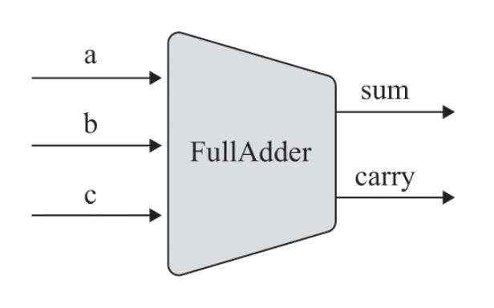

## Table of contents

## Introduction

In this post, we will explore fundamental questions about a computer like why do computers use 1s and 0s? What are the building blocks of a computer? How does a computer perform arithmetic operations? We will do this by constructing our own version of an Arithmetic Logic Unit (ALU) from scratch.

## Why does a computer use 1s and 0s?

### Binary Number System

Computers use the binary number system (aka base 2 number system). This system consists of only two unique digits: 0 and 1. Thus, all information in a computer is represented using combinations of these two digits. But why just two digits? The answer lies in the nature of the electric circuits that make up a computer. These circuits have only two states: on, which is represented by a 1, and off, which is represented by a 0.

The code snippet below shows how we represent decimal numbers in the binary number system. Notice that with each additional digit, the number of possible combinations doubles. With n digits, the total number of unique numbers that can be represented is `2^n`.

```jsx
// 1 digit: 2 possible combinations
0  // zero
1  // one

// 2 digits: 4 possible combinations
00 // zero
01 // one
10 // two
11 // three

// 3 digits: 8 possible combinations
000 // zero
001 // one
010 // two
011 // three
100 // four
101 // five
110 // six
111 // seven
```

If you want to learn more about the binary number system you can watch [this](https://youtu.be/sXxwr66Y79Y) video by Khan Academy or read more about it [here](https://www.mathsisfun.com/binary-number-system.html).

### Two’s Complement

But how do we represent negative numbers using the binary number system? The two’s complement method is the most commonly used method (also known as radix complement). In this method half of the combinations are used to represent negative numbers.

For example, in a 4-bit binary number system, -5 is represented by calculating `2^4 - 5`, which equals 11. In binary, 11 is represented as 1011. To verify, recall that +5 is represented as 0101 in binary. Adding `1011` and `0101` yields `10000`. Ignoring the overflow bit, we get `0000`, confirming that the representation is correct.

```jsx
0000 // 0
0001 // 1
0010 // 2
0011 // 3
0100 // 4
0101 // 5
0110 // 6
0111 // 7
1000 // -8
1001 // -7
1010 // -6
1011 // -5
1100 // -4
1101 // -3
1110 // -2
1111 // -1
```

The code snippet above shows all the possible combinations of signed numbers in a 4-bit binary system.

We can observe the following properties of the two’s complement number system:

- All positive numbers begin with 0, and all negative numbers begin with 1. Thus, the most significant bit (MSB) indicates the sign of the number.
- In an n-bit system, the total number of possible combinations is  `2^n`. Since half of the range is used to represent negative numbers, we can represent numbers ranging from `-2^(n-1)` to `2^(n-1) - 1` (-1 because we have zero as well)
- To get the binary representation of -x from the binary representation of x, flip all the bits of x and then add 1 to the result.

## The Lego blocks of a computer

A logic gate is a basic building block of digital circuits that performs a specific logical function on one or more binary inputs to produce a single binary output.

### Basic Logic Gates

1. NOT Gate
    - **Function:** Outputs the opposite (inverted) value of the input.
    - **Truth Table:**
        
        ```jsx
        A | Output
        -----------
        0 |   1
        1 |   0
        ```
        
2. AND Gate
    - **Function:** Outputs 1 only if all its inputs are 1.
    - **Truth Table**
        
        ```jsx
        A | B | Output
        ---------------
        0 | 0 |   0
        0 | 1 |   0
        1 | 0 |   0
        1 | 1 |   1
        ```
        
3. OR Gate
    - **Function:** Outputs 1 if at least one of its inputs is 1.
    - **Truth Table:**
        
        ```jsx
        A | B | Output
        ---------------
        0 | 0 |   0
        0 | 1 |   1
        1 | 0 |   1
        1 | 1 |   1
        ```
        
4. XOR
    - **Function:** Outputs 1 only if all its inputs are different.
    - **Truth Table:**
        
        ```jsx
        | A | B | Output |
        |---|---|--------|
        | 0 | 0 |   0    |
        | 0 | 1 |   1    |
        | 1 | 0 |   1    |
        | 1 | 1 |   0    |
        ```
        
5. NAND Gate
    - **Function:** Outputs 0 only if all its inputs are 1 (the opposite of the AND gate).
    - **Truth Table:**
        
        ```jsx
        A | B | Output
        ---------------
        0 | 0 |   1
        0 | 1 |   1
        1 | 0 |   1
        1 | 1 |   0
        ```
        

These are just a few of the basic logic gates; there are many more. As we delve deeper, we'll see that these gates form the foundation of a computer, enabling complex operations and computations by combining multiple gates in various configurations.

Among these gates, the NAND gate stands out as a universal gate. This means that any logic gate can be constructed using only NAND gates, making it a powerful and versatile component in digital circuit design. 

Here is the [HDL](https://en.wikipedia.org/wiki/Hardware_description_language) code for creating [NOT](https://github.com/RohitDhatrak/Nand2Tetris/blob/main/1-logic-gates/Not.hdl), [AND](https://github.com/RohitDhatrak/Nand2Tetris/blob/main/1-logic-gates/And.hdl), [OR](https://github.com/RohitDhatrak/Nand2Tetris/blob/main/1-logic-gates/Or.hdl) & [XOR](https://github.com/RohitDhatrak/Nand2Tetris/blob/main/1-logic-gates/Xor.hdl) gates using the NAND gate as a starting point. Additionally, there are 16-bit variants of these gates, which take 16-bit inputs and produce a 16-bit output instead of single-bit outputs. ([NOT16](https://github.com/RohitDhatrak/Nand2Tetris/blob/main/1-logic-gates/Not16.hdl), [AND16](https://github.com/RohitDhatrak/Nand2Tetris/blob/main/1-logic-gates/And16.hdl), [OR16](https://github.com/RohitDhatrak/Nand2Tetris/blob/main/1-logic-gates/Or16.hdl))

### Multiplexer

A multiplexer is a three-input gate that selects between two data inputs, `a` and `b`, based on a third input called the `sel` (selection) bit. The multiplexer outputs the value of `a` when the selection bit is 0 and the value of `b` when the selection bit is 1. The truth table & the diagram of a multiplexer is given below.


**Truth Table:**

```jsx
| sel | a | b | out |
|-----|---|---|-----|
|  0  | 0 | 0 |  0  |
|  0  | 0 | 1 |  0  |
|  0  | 1 | 0 |  1  |
|  0  | 1 | 1 |  1  |
|  1  | 0 | 0 |  0  |
|  1  | 0 | 1 |  1  |
|  1  | 1 | 0 |  0  |
|  1  | 1 | 1 |  1  |
```

This functionality allows a multiplexer to act as a simple switch that chooses between two inputs based on the selection bit. You can check the implementation of a [Mux](https://github.com/RohitDhatrak/Nand2Tetris/blob/main/1-logic-gates/Mux.hdl) using the basic gates that we built earlier. Using the `Mux` chip we can create a [`Mux16`](https://github.com/RohitDhatrak/Nand2Tetris/blob/main/1-logic-gates/Mux16.hdl) chip that will do the same thing but with a 16-bit input.

### Half Adder

A half adder is a digital circuit that performs the addition of two single-bit binary numbers. It produces two outputs: the sum bit and the carry bit.

**Function:**

- **Sum (S):** Represents the sum of the two input bits.
- **Carry (C):** Represents the carry-out bit, which is 1 if the sum exceeds the value that can be represented by a single bit.


**Truth Table:**

```jsx
| A | B | Carry (C) | Sum (S) |
|---|---|-----------|---------|
| 0 | 0 |     0     |    0    |
| 0 | 1 |     0     |    1    |
| 1 | 0 |     0     |    1    |
| 1 | 1 |     1     |    0    |
```

We can observe that the sum and the carry can be computed by using an XOR and AND gate respectively. You can see the implementation of a HalfAdder circuit [here](https://github.com/RohitDhatrak/Nand2Tetris/blob/main/2-alu/HalfAdder.hdl).

### Full Adder

A full adder is a digital circuit that performs the addition of three binary bits: two significant bits (a & b) and an incoming carry bit (Cin). It produces two outputs: the sum bit and the carry-out bit.

**Function:**

- **Sum (S):** Represents the sum of the three input bits.
- **Carry (C):** Represents the carry-out bit, which is 1 if the sum exceeds the value that can be represented by a single bit.



**Truth Table:**

```jsx
| a | b | Cin | Carry (C) | Sum (S) |
|---|---|-----|-----------|---------|
| 0 | 0 |  0  |     0     |    0    |
| 0 | 0 |  1  |     0     |    1    |
| 0 | 1 |  0  |     0     |    1    |
| 0 | 1 |  1  |     1     |    0    |
| 1 | 0 |  0  |     0     |    1    |
| 1 | 0 |  1  |     1     |    0    |
| 1 | 1 |  0  |     1     |    0    |
| 1 | 1 |  1  |     1     |    1    |
```

We can calculate the sum using two Half Adder circuits and then OR the two carry’s from the two Half Adders to give us the final carry output. You can take a look at the implementation [here](https://github.com/RohitDhatrak/Nand2Tetris/blob/main/2-alu/FullAdder.hdl).

### Add16

Using the Half Adder and Full Adder implemented above we can create a circuit that takes two 16-bit binary numbers and outputs the sum of the two numbers.


You can look at the implementation of an Add16 circuit [here](https://github.com/RohitDhatrak/Nand2Tetris/blob/main/2-alu/Add16.hdl).

## How does a computer do basic math?

An Arithmetic Logic Unit (ALU) is a fundamental component of a computer's central processing unit (CPU) responsible for performing arithmetic and logic operations. It is a critical part of the CPU and is essential for executing a variety of tasks that the CPU needs to perform.

### Our ALU Architecture


The ALU (Arithmetic Logic Unit) receives two 16-bit binary inputs, `x` and `y`. Various control pins dictate the operations performed on these inputs before producing the final output. Here is a detailed breakdown of how each control pin influences the process:

1. **zx:**
    - If `zx` is 1, set `x` to 0, regardless of its original value.
2. **zy:**
    - If `zy` is 1, set `y` to 0, regardless of its original value.
3. **nx:**
    - If `nx` is 1, negate the value of `x` (apply bitwise NOT operation to `x`).
4. **ny:**
    - If `ny` is 1, negate the value of `y` (apply bitwise NOT operation to `y`).
5. **f:**
    - If `f` is 1, compute the sum of `x` and `y` (`x + y`).
    - If `f` is 0, compute the bitwise AND of `x` and `y` (`x & y`).
6. **no:**
    - If `no` is 1, negate the result from the `f` operation (apply bitwise NOT to the output of `f`).

Finally, the ALU produces the following outputs:

1. **out:**
    - The result after all specified operations have been applied to `x` and `y`.
2. **zr:**
    - A flag that is set to 1 if the `out` value is zero; otherwise, it is set to 0.
3. **ng:**
    - A flag that is set to 1 if the `out` value is negative (the most significant bit of the 16-bit output is 1); otherwise, it is set to 0.

**Truth Table:**


Using the 6 control bits (zx, nx, zy, ny, f & no) we can do all the above operations with our two inputs x & y

### How to make an ALU?

An Arithmetic Logic Unit (ALU) can be constructed using the basic chips and gates we have created so far. Here’s a detailed explanation of how each step in the ALU works:

```verilog
// zero the x & y input
Mux16(a= x, b= false, sel= zx, out= zeroXResult);
Mux16(a= y, b= false, sel= zy, out= zeroYResult);
```

We check if the `zx` and `zy` control flags are set. If `zx` is set to 1, the input `x` is zeroed. Similarly, if `zy` is set to 1, the input `y` is zeroed. This is done using a `Mux16` chip, which selects between the original input and zero based on the control flags.

```verilog
// negate the x & y input?
Not16(in= zeroXResult, out= notX);
Not16(in= zeroYResult, out= notY);
Mux16(a= zeroXResult, b= notX, sel= nx, out= notXResult);
Mux16(a= zeroYResult, b= notY, sel= ny, out= notYResult);
```

Next, we compute the bitwise NOT of `x` and `y`. Depending on the values of the `nx` and `ny` control flags, we either keep the original values or use their negated forms. The `Mux16` chip is used again to select between the original and negated values.

```verilog
// compute (out = x + y) or (out = x & y)
And16(a= notXResult, b= notYResult, out= andResult);
Add16(a = notXResult, b = notYResult, out = addResult);
Mux16(a= andResult, b= addResult, sel= f, out= fResult);
```

We check if the `f` control flag is set. If `f` is set to 1 the ALU either computes the sum of `x` and `y` otherwise it computes the bitwise AND of `x` and `y`. The `Mux16` chip selects between the AND result and the addition result.

```verilog
// negate the output
Not16(in= fResult, out= notFResult);

// out & ng
Mux16(a= fResult, b= notFResult, sel= no, out=out, out[15]= ng, out[0..7]= outFirst8, out[8..15]= outSecond8);
```

Depending on the `no` control flag, the ALU either keeps the computed result or negates it. The `Mux16` chip selects between the original and negated output. The most significant bit (MSB) of the output is used to determine the sign of the result, setting the `ng` (negative) flag if the MSB is 1. We also break the output in two parts and store it to use in the next step.

```verilog
// zr
Or8Way(in= outFirst8, out= zr1);
Or8Way(in= outSecond8, out= zr2);
Or(a= zr1, b= zr2, out= orZr);
Not(in= orZr, out= zr);
```

To determine if the output is zero, the ALU uses two [`Or8Way`](https://github.com/RohitDhatrak/Nand2Tetris/blob/main/1-logic-gates/Or8Way.hdl) chips to check if any of the bits in the lower and upper halves of the output are 1. If both halves are zero, the `zr` (zero) flag is set to 1 using an `Or` and `Not` gate.

## Conclusion

By combining basic logic gates, multiplexers, and adders, we built an ALU—the heart of a CPU. While we have chosen the NAND gate as our fundamental building block, other gates such as NOR or AND-OR-INVERT (AOI) could also serve as a basis for constructing logic circuits. Also while our ALU is capable of computing 64 different functions, we focus on only 18 of these in our implementation. The design prioritizes functionality over efficiency, more advanced techniques like [carry lookahead](https://en.wikipedia.org/wiki/Carry-lookahead_adder) can significantly optimize arithmetic operations, leading to better performance. Since addition is fundamental to computer architectures, such improvements can have a system-wide impact. However, our approach emphasizes a minimalistic ALU design, delegating complex arithmetic operations to system software. This division reflects a common trade-off in computing: balancing hardware complexity with software flexibility. This foundational understanding takes us a step closer to comprehending how low-level hardware functions and interacts with high-level programming, shaping the core of modern computing systems.